# Credit Risk Analysis

 In recent years, finance has used machine learning to predict credit risk more accurately. Credit approval generally relied on information such as income, credit scores, home ownership, etc., to decide if a loan would get approved.  Banks and lenders have looked into other ways of analyzing information because of the inherent risk that borrowers might not be able to repay their loans. Machine learning provides more accuracy to credit risk modeling by learning from multiple data and predicting an outcome. 


## Project Overview
This project aims to analyze different machine learning models that will predict credit risks and assess each model’s performance.
Using credit card data from LendingClub, I will build and evaluate their performance in predicting low-risk and high-risk credit.  
Credit risk modeling usually entails resampling data because *low-risk* credit usually exceeds *high-risk* credit. 
When datasets are unbalanced, the data needs to be resampled. Therefore, I will use different algorithms to resample the data and address the unbalanced classes. I will also apply *Logistic Regression* since we are measuring binary outcomes. Finally, I will use ensemble learning models that combine multiple decision trees, such as *Balanced Random Forests*, and an *AdaBoost* classifier.


### Resources 

- Data Source: LoanStats_2019Q1.csv
- Libraries: Imbalanced-learn, scikit-learn libraries

 ## Analysis

Credit risk modeling will more accurately predict outcomes if classes are balanced, otherwise, the model could be biased toward the majority class. The first approach I used to address the unbalanced classes was to oversample data.   *RandomOverSampler* and *SMOTE* (Synthetic Minority Oversampling Technique) algorithms are used to address the disparity in data. Another strategy used to balance data is to under sample it; to under sample data, I applied a *ClusterCentroids* algorithm. The last approach for resampling was a combination of under sampling and oversampling with *SMOTEENN*. One advantage of this combinatorial method is that it aims to fix SMOTE’s vulnerability to outliers. 


Before building the machine learning models, I had to preprocess the dataset by converting all the text data into numerical data. I used ```pd.get_dummies``` on the text columns.  

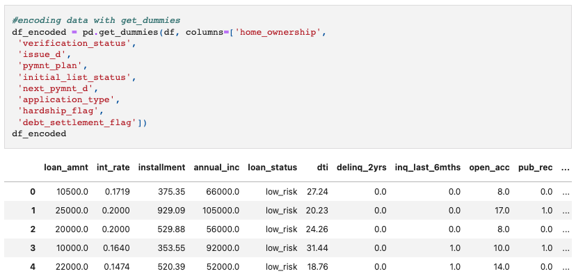

The models will be predicting *low-risk* and *high-risk* credit, therefore our target variable is ```loan_status```. In this dataset, the majority class is *low-risk credit* and the minority class is *high-risk credit*. I separated the target and features variables by assigning ```y``` to  “loan_status”, and ```X``` to all other features in the dataset.  
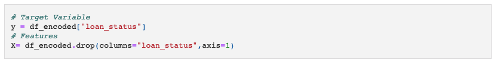

 Using the function ```train_test_split()```, I split the data into training and testing. If we don’t specify, the split percentage the function will split the data into a training set of 75%, and a testing set of 25%. Once we train our model with the training data, we can test it with the rest of the data to observe the model’s accuracy. We can also scale the data so that data points are closer to each other. The following image shows the code used to split and scale the data. 

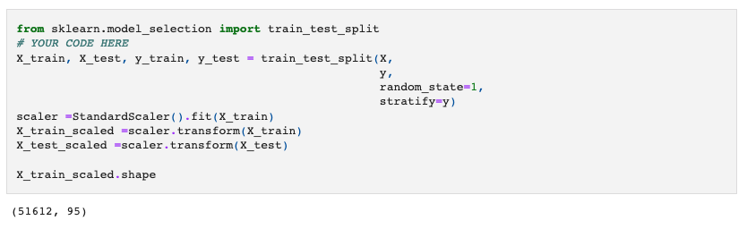

### Resampling Data

-  Random Oversampler

Using the ```Counter``` function we see that our training data is extremely unbalanced. There are 51,352 data points classified as *low-risk* and only 260 as *high-risk*.   

When applying RandomOverSampler to the dataset we are increasing the minority class to match the majority class. Now, we can observe that both samples, *low-risk* and *high-risk* are equal. 

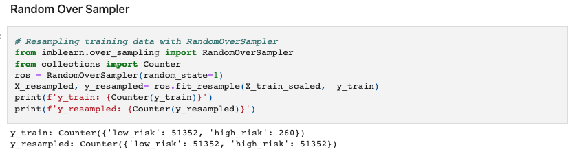

Now that the data is resampled, we can apply logistic regression modeling to predict the outcomes. 

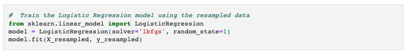

After applying the learning model, I generated the confusion matrix to show the model's performance.
We can see that true *high-risk* are only 87 data points, however, the model had predicted 2,482 data points to be *high-risk*. We can observe that this model is not truly precise.

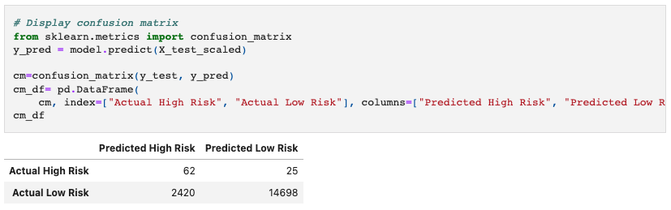

Looking at this confusion matrix closely, we see that it’s not the best model for predicting credit risk. If lenders were to use this model, they could turn away ~14% of borrowers who are likely to pay back their debt.

To observe the model's accuracy in imbalanced datasets we use the ```balanced accuracy score```. This function considers true negatives and false positives, demonstrating how well the model predicts both classes. We can see that the balanced accuracy of this model is ~ 0.78.


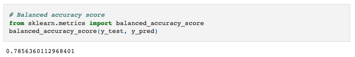

Furthermore, we can look at another metric to see the model's performance, the geometric mean.  The [Geometric Mean](https://support.sas.com/resources/papers/proceedings17/0942-2017.pdf) also measures balance in both classes. Having a low geometric mean indicates that we could be overfitting the majority class and underfitting the minority class.

 
 Looking at the imbalanced classification report we see that the geometric mean is .78, thus indicating that we might need to adjust our data.  Also, precision and recall are somewhat high for the majority class, however, precision is very low for the minority class indicating that we have a high number of false positives.

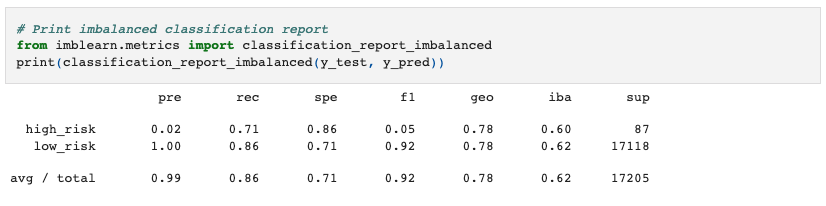


- SMOTE

SMOTE also oversamples the minority class by taking samples from the nearest neighboring data instead of randomly selecting data. 

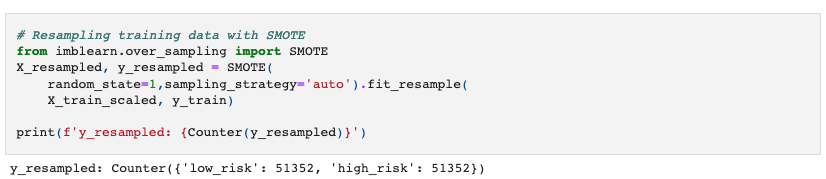

After applying logistic regression to the resample data, I generated a confusion matrix. This matrix shows that this model is not good at predicting credit risk either.

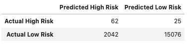

The balanced accuracy score for SMOTE oversampler is ```0.4917187392984195```. This score is even lower than that of Random Oversampler. 

Looking at the imbalanced classification report after using SMOTE, we see that the precision for *high-risk* class is 0.00, however, sensitivity is even higher than our previous model. 

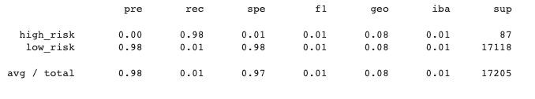

- Cluster Centroid Resampler

To address class imbalance, we can also under sample data using an algorithm such as Cluster Centroids. One of the advantages of under sampling data is that we are using actual data; however, we should only use under sampling when we have sufficient data. 

After under sampling data, the ```y_resampled``` is 260 for both classes.

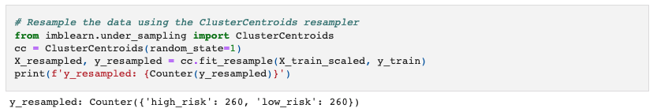

The confusion matrix shows that the model is not doing well at predicting the *low-risk class*. This model has also a high number of false positives. 

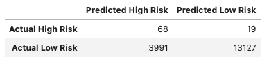

However, the balanced accuracy score of ```0.7742313998976678``` is similar to that of Random Oversampler. Precision and recall are similar as well, and the geometric mean improved from that of SMOTE's algorithm. 

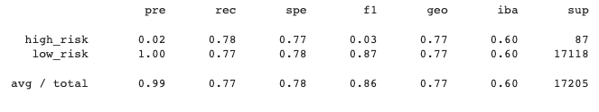

- SMOTEENN Combination Resampling

To improve an unbalanced model's performance we could use SMOTEENN, another method to balance data.
SMOTEENN combines SMOTE and ENN (Edited Nearest Neighbor). This algorithm oversamples the minority class and then cleans the data by removing some outliers from both classes.  

In this resampled data, we see that the minority class was oversampled and that some data points were also dropped. 

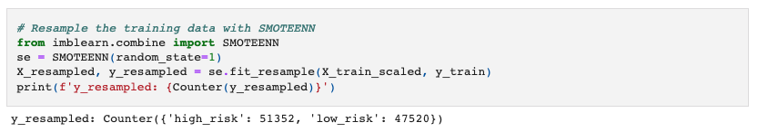

The confusion matrix shows some improvement to that of cluster centroids under sampling. The balanced accuracy score is ```0.7975462408998795```. This model's score is the best so far. 

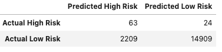

Also, most metrics are similar to Random Oversampler, and the geometric mean is up one point. 

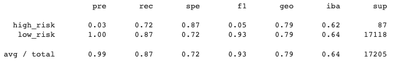


- Balanced Random Forest Classifier

Regular classification algorithms do not perform well with unbalanced data since they do not focus on minority classes.    Random Forest Classifiers (RFC) are a good option for unbalanced data because instead of having one decision tree, RFCs can have multiple small decision trees that will ultimately make a strong machine learning model. However, a [standard random forest](https://medium.com/sfu-cspmp/surviving-in-a-random-forest-with-imbalanced-datasets-b98b963d52eb) for unbalanced data isn’t the best fit, since random forests take in bootstrap samples that may or may not contain samples from the minority class. A *Balanced Random Forest Classifier* is the best option in this case because each bootstrap sample is balanced. This means that each sample contains the same data proportions found in the original dataset. 

The following image shows a Balanced Random Forest Classifier model, using 100 ```n_estimators```. The ```n_estimators``` determine the number of trees that will be created. Having enough decision trees makes the model stronger and more stable. 

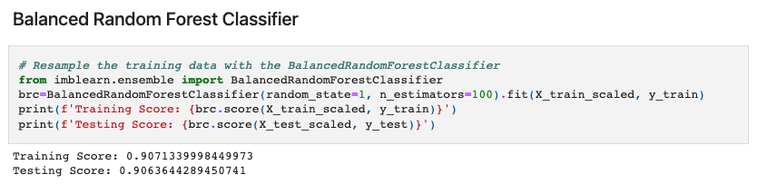

From the confusion matrix results and the imbalanced report, we can see that precision for the majority class is low which means that the model has a large number of false positives. Recall is somewhat low, indicating that we have several *high-risk* loans that will be classified as *low-risk*. 

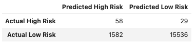

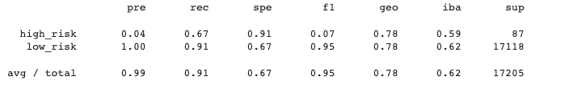

The balanced accuracy score of this model is  ```0.7871246640962729```. This score is similar to that of Random Oversampler and Cluster Centroid Resampler, but lower than SMOTEENN which is ```~0.80 ``` rounded to the nearest hundredths.

**Features of Importance**

Random forests allow you to rank features by their relevance. The ```feature_importances_``` function allows you to understand the relationship between the features and the target variable so that the model can be improved by removing irrelevant variables; thus, the [features of importance](https://towardsdatascience.com/understanding-feature-importance-and-how-to-implement-it-in-python-ff0287b20285) allow you to simplify the mode. 

The five main features of importance for the balanced random forest classification model are shown in the following images. The first contributing feature is ```total_rec_prncp```, which refers to the *principal received to date*. 

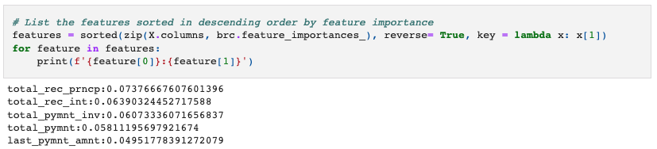

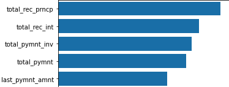

- Easy Ensemble AdaBoost Classifier

The **Easy Ensemble AdaBoost Classifier** trains the model on different balanced samples.  In AdaBoost, many decision trees are combined; however, they are trained in sequence so that each model learns from the errors of the previous one. The weights are increased or boosted each time the model makes a mistake. Combining boosted decision trees makes predictions more accurate.

We can see that the training and testing score are similar in the Easy Ensemble Classifier model. 

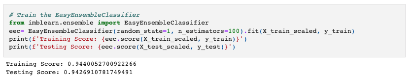

The confusion matrix shows that this model is doing well at predicting *high-risk* credit. The model shows only a few false negatives; therefore, recall is high for the minority class. However, the confusion matrix shows that we have several false positives, thus precision is 0.07 for the minority class.

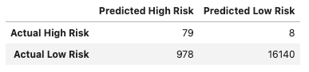

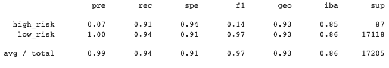

The balanced accuracy score for this ensemble classifier is
```0.9254565671948463```. This score suggests that this model is the best at predicting both classes. 

## Recommendations

After analyzing several machine learning models, I believe that the Easy Ensemble AdaBoost Classifier is the best at predicting both classes showing that there's no bias toward the majority class.  A good accuracy score ranges from 0.7 to 0.9, most of the models had a balanced accuracy score between those ranges. However, the Easy Ensemble AdaBoost Classifier had a balanced accuracy score of ```~0.93```, rounded to the nearest hundredth, indicating that this is the model that provides more accuracy for credit risk modeling.
